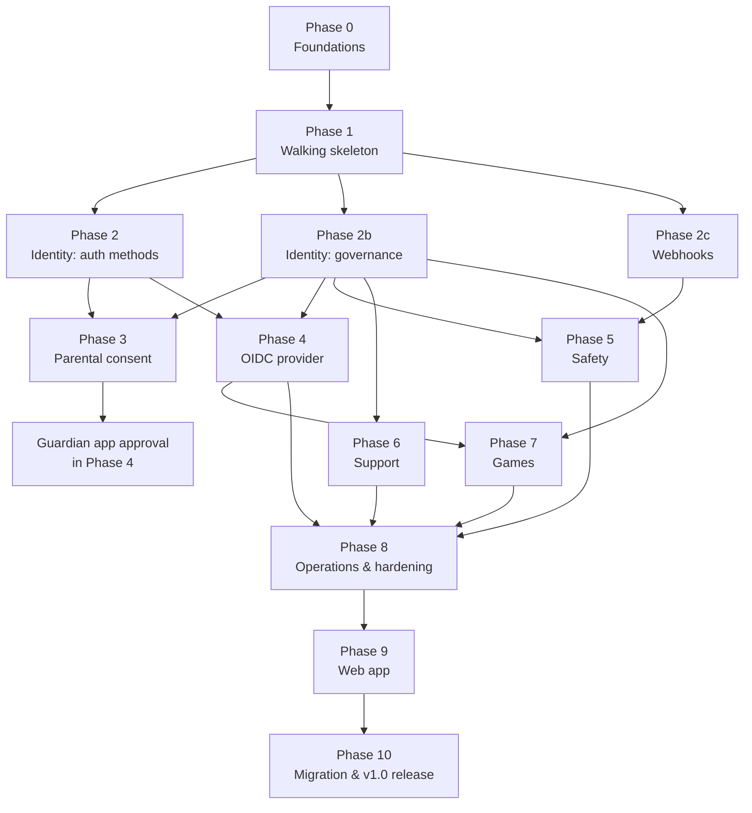

# QTIAuth — Development Roadmap

**Implements:** [SPEC.md](SPEC.md) (final, 2026-09-16)
**Scope:** everything in the spec except items marked `LATER`

This roadmap orders the work by dependency, not by calendar. There are no dates. Each milestone has
an ID, the spec sections it implements, its deliverables, and a **Done when** list that must be
true before anything depending on it starts.

Sizes are rough relative effort: **S** (days), **M** (1–2 weeks), **L** (2–4 weeks), **XL** (a month
or more), for one experienced developer.

---

## How to use this

- **Work top to bottom inside a phase.** Phases 3–8 are independent of each other once their
  dependencies are done, so they can run in parallel (see the graph below).
- **Every milestone inherits the Definition of Done** below. Milestone checklists only list what's
  specific to that milestone.
- **Tick boxes as you go.** A milestone is done when every box is ticked, not when the code merges.
- **Spec changes go in SPEC.md first**, then here. The roadmap never overrides the spec.

---

## Definition of Done (applies to every feature)

A feature isn't done until all of these hold:

- [ ] **Tests:** unit tests for logic, integration tests against real Postgres/NATS/Valkey
      (Testcontainers), and at least one end-to-end test through the gateway.
- [ ] **Config:** every setting in the JSON Schema with defaults and descriptions, validated at startup,
      nothing deployment-specific hardcoded (the CI grep check passes).
- [ ] **Route manifest:** auth mode, permissions, scopes, account-state allowances and rate-limit
      policy declared for every route.
- [ ] **Metrics:** everything listed for this area in SPEC §8.6 is emitted, with no unbounded labels.
- [ ] **Traces and logs:** spans across HTTP and bus hops, and none of the never-log values from §8.6
      appear in logs (checked by a log-scrubbing test).
- [ ] **Audit:** staff and security-sensitive actions publish `audit.recorded`.
- [ ] **Data rights:** the service's `export_user` and `user.deleted` erasure handlers cover any new
      personal data.
- [ ] **Retention:** new data has a retention rule wired into `retention.sweep`.
- [ ] **Events:** new events have a versioned JSON Schema in `packages/events`, and contract tests
      check that the producer's output matches it.
- [ ] **API docs:** OpenAPI is generated and error codes are listed.
- [ ] **Operator docs:** config reference and any runbook steps are updated.

---

## Dependency graph

**Parallel tracks after Phase 2/2b:**
- Track A: Parental consent (3) → OIDC (4) → Games (7)
- Track B: Webhooks (2c) → Safety (5)
- Track C: Support (6)

---

## Phase 0 — Foundations

Nothing user-facing. Everything later builds on these packages, so get them right.

### P0.1 Monorepo and tooling — S ✅
Spec: §11 (decision 1)

- [x] `pnpm` workspace: `packages/*`, `services/*`, `templates/*`, plus `deploy/` and `docs/`.
- [x] TypeScript 6.0 strict mode (erasable syntax only, run with Node type stripping), shared
      `tsconfig.base.json`, ESLint (typescript-eslint strict + stylistic, type-aware), Prettier.
- [x] Node 26 pinned (`.nvmrc`, `engines`, Docker base image).
- [x] Vitest `unit` and `integration` projects, with `@qtiauth/testing` Testcontainers helpers for
      Postgres, Valkey and NATS (JetStream).
- [x] Conventional commits (commitlint + Husky hook) and changelogs per package (Changesets).
- [x] `LICENSE` (MIT), `SECURITY.md`, `CONTRIBUTING.md`, `CODE_OF_CONDUCT.md`.
- [x] Service template (`templates/service`) with a unit test, an infrastructure integration test and
      a Dockerfile.

**Done when:** `pnpm test`, `pnpm lint` and `pnpm typecheck` run green on an empty service template.

### P0.2 CI pipeline — S ✅
Spec: §3.2, §8.9

- [x] GitHub Actions: lint, format check, typecheck, unit tests on every PR and push to `main`.
- [x] Integration tests (Testcontainers on the runner's Docker).
- [x] **Hardcoded-values check** (`pnpm check:hardcoded`, rules in `scripts/hardcoded-rules.json`):
      fails on production domains, company names or brand prefixes such as `QTI_` in source
      (the project name "QTIAuth" is allowed).
- [x] Dependency audit (`pnpm audit`) and container image scan (Trivy, HIGH and CRITICAL).
- [x] Multi-arch image builds (amd64, arm64) for every service Dockerfile, without pushing.
- [x] Commit message check on every commit in a PR.

**Done when:** a PR that adds `quietterminal.co.uk` to source fails CI.

### P0.3 `@qtiauth/config` — M ✅
Spec: §3

- [x] YAML loader with `${env:NAME}` and `${file:/path}` interpolation (after parsing, values only,
      `$${…}` for literals).
- [x] Zod schemas for the §3.3 skeleton sections, picked per service with `serviceConfigSchema`,
      with JSON Schema exported to `config/qtiauth.schema.json` for docs and editor support.
- [x] Precise error paths (YAML path, line and column) on invalid config, unknown keys rejected.
      `loadConfigOrExit` refuses to start.
- [x] `qtiauth config check` command (`@qtiauth/cli`).
- [x] Brand-neutral default config (`config/qtiauth.yaml`) and an example `.env.example`.
- [x] Operator docs: `docs/configuration.md`.

**Done when:** an invalid value produces an error naming the exact YAML path, and `config check`
exits non-zero.

### P0.4 `@qtiauth/db` — M ✅
Spec: §2.3

- [x] Kysely setup with per-service schema and role (`createDb`, `database` config section).
- [x] Migration runner: forward-only, advisory lock per schema, `auto_apply` on/off, `migrate status|up`
      (`runStartupMigrations`, `migrateCommands` in `@qtiauth/cli`).
- [x] Refuses to start with pending migrations when `auto_apply: false`, logging the exact command.
- [x] Role provisioning script: one role per service, privileges on its own schema only
      (`qtiauth db provision`).
- [x] Expand/contract migration guide in `docs/database.md`.

**Done when:** two replicas starting at once apply migrations exactly once, and a service role can't
read another service's schema (tested).

### P0.5 `@qtiauth/bus` — L ✅
Spec: §2.4

- [x] NATS connection management and JetStream stream/consumer provisioning (`connectBus`,
      `provisionStreams`, `ensureConsumer`, `bus` config section).
- [x] Event envelope types and `packages/events` JSON Schemas with a versioning convention
      (`@qtiauth/events`, `loadEventCatalog`, `docs/bus.md`).
- [x] **Transactional outbox:** table, writer helper that runs inside a Kysely transaction, relay loop,
      metrics for backlog size and age (`createBusTablesV1`, `writeEvent`, `startOutboxRelay`).
- [x] Idempotent consumer helper (dedupe on `event_id`) (`consumeEvents`).
- [x] Request/reply helper with deadlines and typed "no responders" handling (`rpcRequest`,
      `serveRpc`).
- [x] Work-queue consumer helper (for cron jobs and email) (`consumeWork`, `consumeCron`).
- [x] Contract test helper (`assertEventContract`, `@qtiauth/bus/testing`).

**Done when:** killing a service between commit and publish loses no events (tested), and redelivered
events are processed once.

### P0.6 `@qtiauth/observability` — M ✅
Spec: §8.6

- [x] Structured JSON logger with a redaction list and a log-scrubbing test helper (`createLogger`,
      `REDACTED_KEYS`, `assertLogsScrubbed` in `@qtiauth/observability/testing`,
      `observability` config section).
- [x] OpenTelemetry tracing: HTTP, Kysely, NATS, with trace context propagated through event envelopes
      (`startTracing`, `traceHttpRequest`, `tracedFetch`, `tracedDialect` used by `createDb`, spans in
      `@qtiauth/bus`, `span_id` in the envelope).
- [x] Prometheus registry with a label-cardinality guard (rejects label names like `user_id`, `email`,
      `ip`) (`createMetrics`, `prometheusBusMetrics`).
- [x] `/healthz` and `/readyz` helpers (`liveness`, `readiness`, `healthResponse`,
      `databaseHealthCheck`, `busHealthCheck`, `docs/observability.md`).

**Done when:** one request produces a single trace spanning HTTP → DB → bus publish → consumer.

### P0.7 `@qtiauth/service-kit` — M ✅
Spec: §2.6, §8.3

- [x] Hono service skeleton: config, DB, bus, observability, graceful shutdown (`defineService`,
      `startService`, `runService`, `service` config section, `docs/services.md`).
- [x] Internal identity token verification middleware (`X-QTIAuth-Identity`) (`verifyIdentityToken`,
      `signIdentityToken`, `busIdentityKeys` over `qtiauth.rpc.gateway.identity_keys`).
- [x] Route definition helper that produces the **route manifest** and **OpenAPI** from one source
      (`createServiceRouter`, `openApiDocument`, announced on `qtiauth.sys.announce`).
- [x] RFC 9457 Problem Details error helper and error-code registry (`defineErrors`, `ProblemError`,
      `KIT_ERRORS`).
- [x] Cursor pagination helper (`paginationQuery`, `pageSchema`, `pageOf`, `decodeCursor`).
- [x] Permission declaration helper (`definePermissions`, with `wildcard: false` for permissions a
      wildcard must never match).
- [x] `export_user` and erasure handler registration (`registerDataRights`, `dataRights` on
      `startService`).
- [x] `qtiauth` CLI framework shared by all services (`runServiceCli`, `configCommand` in
      `@qtiauth/cli`, `routes manifest|openapi`).

**Done when:** a template service created with the kit has health endpoints, metrics, a manifest and
OpenAPI with no extra code.

### P0.8 Compose base — S ✅
Spec: §2.2

- [x] `deploy/compose.yaml` with `postgres`, `valkey`, `nats` (JetStream enabled) and an internal
      network (images kept in step with `@qtiauth/testing`, `docs/deployment.md`).
- [x] Profile scaffolding for every profile in §2.2 (empty services allowed at this stage)
      (placeholder containers, with QTIAuth services extending `x-qtiauth-service`).
- [x] `.env.example` with every secret documented.
- [x] Dev override file with the `console` email provider and exposed debug ports
      (`deploy/compose.dev.yaml`, `config/qtiauth.dev.yaml`, ports bound to `127.0.0.1`).

**Done when:** `docker compose up` brings up healthy infra, and `--profile games` doesn't error.

---

## Phase 1 — Walking skeleton

A thin, real, end-to-end slice: **sign up and sign in with a magic link through the gateway, on one
host.** Proves the architecture before building breadth.

### P1.1 Gateway core — L ✅
Spec: §2.6, §2.7, §8.1, §8.3, §8.9

- [x] Service announce handling and dynamic route table from manifests (`services/gateway`,
      `startDiscovery`, `buildRouteTable`, `gateway` config section, `docs/gateway.md`).
- [x] Single-host surface routing (`account`, `api`), with core API mounted per §2.10
      (`matchSurface`, `mountPath`, `surfaces.<name>.origins`).
- [x] Declared route policy enforcement: auth mode, permissions, account states, legal/parental gates
      (gates return the right codes even before the features exist) (`checkPolicy`).
- [x] Session cookie resolution via Valkey with Postgres fallback over RPC (`createSessionResolver`,
      `qtiauth.rpc.identity.resolve_session`, cache cleared by identity events through
      `consumeIdempotentEvents`, `@qtiauth/valkey`, `valkey` config section).
- [x] **Internal identity token:** EdDSA key generated and stored encrypted, 60 s tokens, key rotation
      job (`openKeyring` over NATS KV, envelope encryption with `KEY_ENCRYPTION_KEY`, `keys.rotate`).
- [x] Rate limiting: named policies, sliding window in Valkey, `RateLimit-*` headers, fail-open/closed
      (`createRateLimiter`, `rate_limits` config section with policy groups).
- [x] Trusted-proxy client IP extraction (`clientIp`).
- [x] CORS from config (`allowedOrigins`, plus the `Origin` check for state-changing requests).
- [x] Security headers (`applySecurityHeaders`, `gateway.hsts`).
- [x] Merged OpenAPI at `/api/v1/openapi.json` (`mergeOpenApi`, per surface, with gateway error codes).
- [x] `/api/v1/meta/features` and `/api/v1/meta/health` with the consistency check (§2.2)
      (`featuresReport`, `healthReport`).

**Done when:**
- A request without the internal token is rejected by a service even from inside the network.
- Every route, including auth routes, is rate-limited (tested by an exhaustive manifest check).
- Enabling a sub-feature of a service that isn't running shows up as a health error.

### P1.2 Scheduler — S ✅
Spec: §2.8

- [x] Cron schedules from config, published as `qtiauth.sys.cron.<job>` (`services/scheduler`,
      `startScheduler`, `scheduler` config section, `qtiauth jobs list`, `docs/scheduler.md`).
- [x] Work-queue consumption so each job runs once across replicas (`consumeCron`, ticks deduplicated
      by `<job>@<scheduled_at>` so scheduler replicas are safe too).
- [x] Job metrics (runs, duration, failures) (`qtiauth_cron_runs_total` and
      `qtiauth_cron_run_duration_seconds` from `consumeCron`, `qtiauth_scheduler_ticks_total`,
      `qtiauth_scheduler_publish_failures_total`, `qtiauth_scheduler_next_tick_timestamp_seconds`).

**Done when:** a job with 3 consumer replicas runs exactly once per tick.

### P1.3 Notifier: email — M ✅
Spec: §5.1

- [x] Provider interface with `console` and `smtp` implementations (`services/notifier`,
      `EmailProvider`, `consoleProvider`, `smtpProvider`, `email` config section, `docs/notifier.md`).
- [x] MJML + text templates, per-locale directories, config overrides, typed variables validated at
      startup (`EMAIL_TEMPLATES` in `@qtiauth/email`, `loadTemplates`, `email.templates_dir`,
      `qtiauth templates check`).
- [x] JetStream outbound queue with priorities and retries (`queueEmail`,
      `qtiauth.work.notifier.email.high|normal`, `email.queue`, per-consumer `retry` in `@qtiauth/bus`).
- [x] Delivery log (`email_deliveries` in the `notify` schema, swept by `retention.sweep` after
      `retention.delivery_logs`, covered by `export_user` and erasure, `qtiauth_email_*` metrics).

**Done when:** a missing template variable stops startup, and a dead SMTP server delays mail without
failing the triggering request.

### P1.4 Identity: accounts, magic link, sessions — L ✅
Spec: §4.1 (core), §4.3, §4.8 (core)

- [x] Account state machine, email normalization from config, `accounts.max_per_email`
      (`services/identity`, `ACCOUNT_TRANSITIONS`, `emailNormalizer`, `accounts` config section,
      `docs/identity.md`).
- [x] `identities` table and magic-link identity (`recordIdentityUse`).
- [x] Magic link start/verify with identical responses, POST confirmation page, DOB collected after the
      click (`/api/v1/auth/magic-link/start|verify|signup`, interim pages at `/auth/magic-link` and
      `/auth/signup`, `magic_link` config section, `auth_verify` rate-limit policy). Under
      `parental.consent_age`, signup answers `PARENTAL_CONSENT_UNAVAILABLE` until P3.1.
- [x] Opaque sessions: hashed tokens, bindings table (single binding for now), idle and absolute
      expiry, `max_per_user` eviction (`sessions` and `session_bindings`, `resolve_session`, identity
      sets the cookie through `X-QTIAuth-Session-*` headers the gateway honours, `sessions` config
      section).
- [x] Session list and revoke one, others or all (`/api/v1/sessions`, `identity.session.revoked`,
      `X-QTIAuth-Revoked-Sessions` clears the gateway's cache before it answers).
- [x] `GET /api/v1/me`, logout.
- [x] Minimal age band computation from DOB (full age work in Phase 2b) (`ageBand`, `age` config
      section).
- [x] Retention sweep for sessions and tokens (`retention.sessions`, `retention.tokens`, covered by
      `export_user` and erasure, `qtiauth_auth_*`, `qtiauth_sessions_*` and `qtiauth_accounts`
      metrics).

**Done when (end-to-end through compose):**
- A new user signs up by magic link, lands signed in, sees their session, and logs out.
- Magic-link start for an existing and a non-existing email returns byte-identical responses.
- Revoking a session takes effect on the very next request.

**Phase 1 exit demo:** `docker compose up`, sign up with a magic link (link printed by the `console`
provider), sign in, list sessions, revoke, and see the trace in the logs.

---

## Phase 2 — Identity: auth methods

### P2.1 Passwords — M
Spec: §4.2

- [x] Signup choice (password or magic link), email verification before `active`.
- [x] Argon2id with config parameters and rehash on login.
- [x] Length limits (max 256), optional composition rules, HIBP k-anonymity check (fails open),
      email/username containment check.
- [x] Add password to passwordless accounts (step-up), change password.
- [x] Forgot password with the **"Don't log me out of other sessions"** checkbox, unticked by default.
- [x] Progressive delay on failures per account and IP. No hard lockout.
- [x] Equal-timing login for unknown accounts (tested statistically).

**Done when:** timing and response for unknown vs known email are indistinguishable in tests, and
reset revokes other sessions unless the box is ticked.

### P2.2 CAPTCHA — S ✅
Spec: §8.2

- [x] Provider interface with `altcha` (default), `turnstile`, `hcaptcha`, `friendly_captcha`, `none`.
- [x] Adaptive triggering from rate/failure thresholds, wired into signup, password login and
      magic-link start.

**Done when:** CAPTCHA appears only after the threshold and is required until solved.

### P2.3 Passkeys, TOTP, recovery codes, step-up — L ✅
Spec: §4.5

- [x] WebAuthn registration and authentication, as primary sign-in or second factor, with named
      credentials and last-used time.
- [x] TOTP with encrypted secrets (`APP_ENCRYPTION_KEY`).
- [x] 10 hashed single-use recovery codes, regenerable.
- [x] `aal1`/`aal2` on sessions, step-up window, `STEP_UP_REQUIRED` errors, route policy `step_up`.
- [x] Staff 2FA enforcement by permission (enrolment-only access until enrolled).

**Done when:** passkey-only accounts reach `aal2`, and a route with `step_up: true` rejects an `aal1`
session.

### P2.4 Social and upstream sign-in — L
Spec: §4.4, §4.1 (linking rules)

- [x] Provider framework: state/PKCE/nonce in Valkey, callback handling, per-provider enable and
      config validation.
- [x] Google, GitHub, Discord, generic OIDC upstreams.
- [x] Steam OpenID 2.0 (sign-in and linking).
- [x] Verified-email rules per provider (§4.4 table). Unverified or missing emails go through our own
      verification.
- [x] Explicit "Connect …" linking only while signed in. No automatic linking by email.
- [x] Last-sign-in-method protection with the exact warning text from §4.1.
- [x] Change email flow with the revert link to the old address.

**Done when:** a provider email matching an existing account **does not** link or sign in to that
account (tested), and removing the last method shows the warning.

### P2.5 Multi-surface sessions — L
Spec: §2.10

- [x] Surface config with hosts, ports, base paths and module ownership.
- [x] Core API mounted on every surface. Module APIs only on their owning surface.
- [x] Automatic credentialed CORS for surface origins.
- [x] **Session bindings:** bind redirect, single-use codes bound to target origin and return path,
      callback exchange, per-host cookies, loop protection.
- [x] Logout and revocation invalidate every binding. Stale cookies cleared on next request.
- [x] Same-site detection per surface pair, reported in `meta/features` and the health page.

**Done when (e2e with three hostnames on two different registrable domains):**
- Signing in on `account` makes `support` signed in after one silent redirect.
- Logging out on `support` signs the user out of `account` on the next request.
- The session list shows one session.

### P2.6 Session security — M
Spec: §4.8, §2.9

- [x] GeoIP sources: DB-IP Lite (default), MaxMind, header, none. `geoip-updater` container.
      CC-BY attribution added to docs and the about page.
- [x] Signal collection and weighting, trust-level transitions.
- [x] Country-change policy: `challenge` (default), `block`, `notify`, `ignore`.
- [x] Optional TLS fingerprint header.
- [x] New-device sign-in email, with the app-wide toggle.
- [x] Security event log and rate-limited alert emails.

**Done when:** a country change under `challenge` drops the session to `aal0` and re-auth restores it,
without creating a new session.

---

## Phase 2b — Identity: governance

Can run alongside Phase 2 after Phase 1.

### P2b.1 Text filter — L
Spec: §4.11

- [x] **Licence check first:** confirm redistribution terms for LDNOOBW, SCOWL, the name lists, the
      surname list and GeoNames. Record them in `THIRD_PARTY_NOTICES.md`.
- [x] `qtiauth lists update` (pinned LDNOOBW commit, space stripping, B_exact/B_loose derivation).
- [x] `qtiauth lists audit` (words in D containing a B substring).
- [x] Normalization, tokenizer, singleton collapsing, padding detection, pipeline exactly per spec.
- [x] `filter_decisions` logging and admin endpoints for recent blocks, unknowns, allowlist and extra
      blocklist.
- [x] **Regression corpus:** Scunthorpe-class place names, common names and surnames, `classic`,
      `assassin`, `user1`, `c_u_n_t`, `xxx<slur>xxx`, leet variants. Runs in CI.

**Done when:** the regression corpus passes, and `lists audit` output is reviewed with missing words
added to D.

### P2b.2 Usernames — M ✅
Spec: §4.10

- [x] Claim once, changes with cooldown and yearly limit, history.
- [x] Rules, reserved names and reserved prefixes from config (empty by default).
- [x] Release hold where **only the previous owner** can reclaim during the hold.
- [x] Filter integration with the generic "Username not available" response.

**Done when:** a renamed user can reclaim their old name during the hold and another user can't.

### P2b.3 Age bands and assurance interface — M ✅
Spec: §4.6

- [x] Configurable bands, daily recompute job, `age_band_changed` events.
- [x] `AgeAssuranceProvider` interface and the `self_declared` provider.
- [x] Assurance result records, and `required_for` triggers.
- [x] Staff-only DOB edits with a reason and audit.
- [x] Under-18 default settings.

**Done when:** a user crossing 18 overnight emits the event and changes band without logging in.

### P2b.4 RBAC and admin bootstrap — M ✅
Spec: §4.14

- [x] Permission registry built from service manifests. Roles in config and editable in the UI.
- [x] `safety.csea.access` excluded from wildcard matching.
- [x] Permissions carried in the internal identity token.
- [x] `qtiauth admin create` one-time signup link.

**Done when:** a role with `*` can't access anything requiring `safety.csea.access` (tested).

### P2b.5 Audit log — M ✅
Spec: §4.15

- [x] `audit.recorded` consumer and store.
- [x] Hash chain, and an `INSERT`/`SELECT`-only role.
- [x] Filtering by actor, action, target and date.
- [x] `qtiauth audit verify`.

**Done when:** editing any audit row directly in Postgres makes `audit verify` fail and name the row.

### P2b.6 Legal documents — M ✅
Spec: §4.9

- [x] Front-matter parsing, sync on startup, immutable versions (error on edited body without version
      bump).
- [x] Acceptance records.
- [x] Material change gate via route policy, with the non-material notification.
- [x] Public version history toggle.
- [x] Guardian acceptance path stubbed until Phase 3.

**Done when:** publishing a material version gates every non-exempt route after `effective_at`, and
accepting lifts the gate on every surface.

### P2b.7 Admin: users — M ✅
Spec: §4.13

- [x] Search and filters (Postgres FTS).
- [x] User detail assembled over RPC, with optional-service sections omitted when the service isn't
      running.
- [x] Ban, unban, lock with expiry, unlock, force re-auth, revoke sessions, force username reset,
      edit DOB.

**Done when:** user detail renders correctly with only core services running and with every profile
enabled.

### P2b.8 Account lifecycle and object storage — L
Spec: §4.12, §2.11

- [x] `storage` profile (MinIO) and the external S3 option, with presigned upload/download helpers in
      service-kit.
- [x] Data export orchestration over RPC, with a zipped result, expiring link, and email fallback.
- [x] Deletion: grace period, cancel on sign-in, `user.deleted` fan-out, erasure handlers in every
      existing service.
- [x] Legal hold interface (used by Safety in Phase 5).
- [x] **Deletion ledger writer** with an outbox to the backup destination. Restore replay comes in
      P8.1.

**Done when:** deleting a user removes their data from every running service and object storage, and
a ledger entry exists at the backup destination.

### P2b.9 Notification preferences — S ✅
Spec: §4.16

- [x] Categories registered per service, user toggles, non-disableable security and legal categories,
      staff alert preferences.

**Done when:** a user can't disable a security category through the API.

---

## Phase 2c — Webhooks

Depends on Phase 1 only.

### P2c.1 Webhook delivery — L
Spec: §5.2

- [ ] Endpoint management (admin API and config seeding) with event subscriptions and wildcards.
- [ ] Standard Webhooks signing, secret rotation with an overlap window.
- [ ] `discord` and `slack` formats.
- [ ] Retries with backoff for up to 24 h, auto-disable after N failures, and an admin email.
- [ ] Delivery log, replay, test event.
- [ ] SSRF protection (resolved-IP check at connect time, not only at save time).
- [ ] Payload minimisation. `trust` field passed through for game events.

**Done when:**
- A pasted Discord channel webhook URL receives a readable message.
- An endpoint whose DNS resolves to `127.0.0.1` is refused.
- A receiver using an off-the-shelf Standard Webhooks library verifies signatures.

---

## Phase 3 — Parental consent

Depends on Phases 2 and 2b.

### P3.1 Consent flow — L
Spec: §4.7 (signup)

- [ ] Guardian email at signup below `consent_age`, `pending_parental_consent` state and its
      restricted view.
- [ ] Resend and change guardian email (max 3).
- [ ] Guardian email with approve/decline, guardian DOB confirmation, terms acceptance on the child's
      behalf.
- [ ] Expiry job deletes unapproved accounts after `pending_ttl`.

**Done when:** an unapproved child account is fully erased after the TTL, including any ledger entry.

### P3.2 Family dashboard and controls — L
Spec: §4.7

- [ ] Guardian access by magic link, or linked to their own account. Up to `max_guardians`.
- [ ] Controls: game restrictions (in the internal token), leaderboards/profile visibility, child
      sessions, username change approval, data rights on the child's behalf.
- [ ] Guardian notifications.
- [ ] Legal acceptance for child accounts routed to guardians (completes P2b.6).
- [ ] Activity summary: the weekly email plus dashboard shell. It fills in as Games (playtime) and OIDC
      (connected apps) land.

**Done when:** every control in the §4.7 table works end to end through the API.

### P3.3 Graduation — M
Spec: §4.7 (graduation)

- [ ] Notifications at `consent_age`, grace period.
- [ ] Guardian-link removal needs **young person request + guardian approval**, with reminders.
- [ ] Self-service removal at the adult band.

**Done when:** a 14-year-old can't remove the link without guardian approval, and an 18-year-old can.

---

## Phase 4 — OIDC provider (`oidc` profile)

Depends on Phases 2 and 2b.

### P4.1 Keys — M
Spec: §6.1 (keys)

- [ ] Shared key-management package: generation, envelope encryption (`KEY_ENCRYPTION_KEY`),
      rotation schedule, publish-until-expired.
- [ ] Adopt it in the gateway (replacing the P1.1 internal-token key code).

**Done when:** rotation publishes the new key before use and keeps the old one until its last token
expires.

### P4.2 Core protocol — XL
Spec: §6.1 (protocol, scopes, consent)

- [ ] Discovery and JWKS.
- [ ] Authorization code with mandatory PKCE S256, exact redirect matching, RFC 8252 loopback.
- [ ] Consent screen (see the note on interim pages below), stored consent, first-party skip.
- [ ] JWT access tokens (RFC 9068) and ID tokens (RS256 and ES256, `at_hash`).
- [ ] Refresh rotation with **reuse detection** revoking the family.
- [ ] `userinfo`, `revoke`, `introspect`.
- [ ] Scopes and claims from config, including `age`, `parental_controls`, `restrictions`.
- [ ] `auth: oauth` enforcement in the gateway (audience and scope checks).
- [ ] **Credential separation test:** an OAuth access token is rejected on every `auth: session` route.

**Done when:** the **OpenID Foundation conformance suite** (Basic OP, Config OP, and the PKCE/refresh
tests) passes, and the credential separation test passes for every route in every manifest.

### P4.3 Additional grants — L
Spec: §6.1

- [ ] `client_credentials` and the `auth: service` gateway mode.
- [ ] Device Authorization Grant (RFC 8628) with its user code entry page.
- [ ] Pushed Authorization Requests (RFC 9126), optional per client.

**Done when:** a CLI signs in with the device flow, and a service token can't reach a user-session route.

### P4.4 Back-channel logout — M
Spec: §6.1 (back-channel logout)

- [ ] Client `backchannel_logout_uri` registration.
- [ ] Logout tokens on session end from any cause (logout on any surface, revocation, lock, ban,
      deletion).
- [ ] Queued delivery with retries and a per-client delivery log.
- [ ] Refresh-token revocation rules (`offline_access` exceptions).
- [ ] Discovery metadata.

**Done when:** the conformance suite's back-channel logout tests pass, and logging out on `support`
triggers a logout token to an app signed in via `account`.

### P4.5 Developer portal — M
Spec: §6.1 (developer portal)

- [ ] Client create/list/edit/delete, step-up secret regeneration, public and confidential types.
- [ ] No approval gate. "Unverified app" state, the verify permission, suspension (revokes tokens).
- [ ] Filter on names and descriptions, brand-name protection, per-user client limit, no clients for
      child accounts.
- [ ] Authorized apps list and revoke for users.

**Done when:** suspending a client invalidates its live access tokens on the next introspection and
JWT check.

### P4.6 Guardian app approval — M
Spec: §4.7, §6.1 (consent)

- [ ] Child consent to non-first-party clients becomes a pending guardian request. Approval completes
      the authorization.
- [ ] Connected apps feed the guardian activity summary.

**Done when:** a child authorization only completes after guardian approval, and a decline tells the
client `access_denied`.

---

## Phase 5 — Safety (`safety` profile)

Depends on Phases 2b and 2c.

### P5.1 Reporting — M
Spec: §6.2 (reporting)

- [ ] Taxonomy from config, including per-type SLAs and CSEA flags. Ships the default OSA-mapped
      taxonomy.
- [ ] User and content reports with snapshots, status lookup.
- [ ] Game intake API (`auth: service` and `auth: oauth`) and automated flag intake.
- [ ] Reporter acknowledgement and outcome notifications. Reporter anonymity.
- [ ] SLA breach detection and events.

**Done when:** a report from a game server appears in the queue, and an overdue report emits
`sla_breached` to a webhook.

### P5.2 Moderation — L
Spec: §6.2 (moderation)

- [ ] Queue, detail, dismiss, history per user and per moderator.
- [ ] Config-defined actions with real effects: warn, restrict, force username reset, lock, ban,
      remove content, proscribed org removal.
- [ ] Restrictions in the internal token and `restrictions` claim, with expiry.
- [ ] Statement of reasons (rule selection required).
- [ ] Basic appeals: Support ticket when Support is enabled, minimal Safety form otherwise.
- [ ] Optional two-person rule for permanent bans.
- [ ] Accountable person config.

**Done when:** every action type has a tested effect, and a banned user can reach only appeals,
support and data rights.

### P5.3 CSEA / NCA workflow — L
Spec: §6.2 (CSEA)

- [ ] **Before starting:** confirm report fields, timeframes and retention against SI 2026/268 and
      current NCA CSEA-IRP guidance. Record the findings in `docs/compliance/csea.md` and set config
      defaults from them.
- [ ] **Before starting:** register the deployment operator with the NCA portal (operator task,
      documented in the runbook).
- [ ] Case creation from flagged types and reclassification.
- [ ] Encrypted, isolated evidence store under a legal hold (uses the P2b.8 interface).
- [ ] Access restricted to `safety.csea.access`, with every view audited.
- [ ] Guided submission checklist, NCA reference and timestamp recording, deadline tracking.
- [ ] One-click lock + removal request.
- [ ] Alert-only notification to `csea_alert_emails`.
- [ ] Evidence retention and audited destruction.

**Done when:**
- A **leak test** proves no CSEA case content reaches logs, traces, metrics labels, webhooks or email
  bodies.
- Deleting the reported account leaves the held evidence intact.

---

## Phase 6 — Support (`support` profile)

Depends on Phase 2b. Uses Phase 5 for appeal linking if present.

### P6.1 Tickets — L
Spec: §6.3 (tickets)

- [ ] Create, list, view, reply, close, reopen, rate. Sequential numbers.
- [ ] Priority, status, assignment, internal notes. Categories from config.
- [ ] Appeals from banned/locked accounts via route policy (one per enforcement action, linked to the
      Safety action when present).
- [ ] Staff and user emails per preferences.
- [ ] Canned responses, auto-close with a halfway reminder.
- [ ] Staff metrics.

**Done when:** a banned user can open exactly one appeal per action and nothing else.

### P6.2 Guest tickets and attachments — M
Spec: §6.3

- [ ] Guest tickets: email code verification, magic-link access, CAPTCHA and rate limits,
      guest-allowed categories.
- [ ] Attachments: type and size limits, content sniffing, signed download URLs with
      `Content-Disposition: attachment`, staff warning on non-images.

**Done when:** a renamed `.html` upload is rejected or served as a download, never rendered.

### P6.3 Knowledge base — M
Spec: §6.3 (knowledge base)

- [ ] Articles, categories, drafts and publishing, tags, slugs.
- [ ] Weighted FTS search.
- [ ] Revision history with diff and restore.
- [ ] Image uploads.
- [ ] Rate-limited, deduplicated feedback.
- [ ] Related-article suggestions for the ticket subject.
- [ ] Server-side Markdown with a strict sanitizer (tested against an XSS corpus).

**Done when:** the XSS corpus renders inert, and restoring a revision recreates the exact earlier
content.

---

## Phase 7 — Games (`games` profile)

Depends on Phases 2b and 4 (tokens, `client_credentials`, device flow).

### P7.1 Catalog, products, entitlements — L
Spec: §7.1, §7.2

- [ ] Games with statuses and full CRUD.
- [ ] Automatic game server client per game, with secret rotation.
- [ ] Products and entitlements with sources, expiry and revocation.
- [ ] Admin grant/revoke and the external grant API.
- [ ] Owned endpoints.

**Done when:** a timed beta entitlement expires on schedule and disappears from `owned`.

### P7.2 Trust model and game auth — M
Spec: §7.0, §7.5 (game-authoritative writes)

- [ ] `auth: game_authoritative` in the gateway: both tokens required, both issued for the same game,
      act on the player token's `sub`.
- [ ] `achievements.write` and `game_stats.write` scopes, grantable only to the game's own client.
- [ ] `trust` field on every game event and webhook payload.
- [ ] **Guard test:** no built-in automation grants entitlements or keys from `trust: player` events.

**Done when:**
- A player token alone is rejected on game-authoritative routes, as is a server token alone, and so
  are tokens from two different games.
- The guard test passes.

### P7.3 Key redemption — M
Spec: §7.3

- [ ] Batch generation, labels, expiry.
- [ ] Redemption on web and via API, with limits, failure tracking and CAPTCHA.
- [ ] CSV export (step-up), batch revoke with optional entitlement revocation.

**Done when:** brute-forcing keys from one IP hits CAPTCHA, then rate limits.

### P7.4 Achievements — M
Spec: §7.4

- [ ] Definitions, hidden achievements, progress achievements with auto-unlock.
- [ ] Trust-based unlock and progress with the game's player token.
- [ ] Nightly rarity. Admin revoke.

**Done when:** a token from a different authorized app can't unlock another game's achievement.

### P7.5 Stats, leaderboards, playtime — L
Spec: §7.5

- [ ] Stat definitions with `authority: player | game`, max-delta bounds, `custom_data`.
- [ ] Leaderboards with reset periods and history.
- [ ] `require_game_authority` global and per-game toggle, enforced at leaderboard definition time.
- [ ] Visibility, including under-18 hidden by default and guardian/teen opt-in. Admin entry removal.
- [ ] Playtime sessions and heartbeats, remaining-time endpoint for `daily_playtime_minutes`.
      Feeds the guardian summary (completes P3.2).
- [ ] Developer docs include the **"what game authority does and doesn't protect against"** note.

**Done when:** with `require_game_authority: true` a leaderboard can't be created on a player-authority
stat, and a weekly board resets while keeping history.

### P7.6 Licensing — M
Spec: §7.7

- [ ] Leases with `jti`, per-game duration and all owned products.
- [ ] Dedicated licensing keys at `/.well-known/qtiauth-license-keys.json`.
- [ ] Online verify endpoint, signed revocation list.
- [ ] Optional device binding with `max_devices` and a self-service device list.
- [ ] Admin revoke.
- [ ] **Sample offline verifier** (small TypeScript and C# snippets) in the docs.

**Done when:** the sample verifier validates a lease with the network disabled and rejects it after
pulling a revocation list that contains its `jti`.

### P7.7 Cloud saves — M
Spec: §7.6

- [ ] Slots, presigned uploads and downloads, version history, `base_version` conflict detection,
      per-game quotas.
- [ ] Export and erasure handlers.

**Done when:** two clients writing from the same base version produce one success and one conflict.

### P7.8 Steam — L
Spec: §7.8

- [ ] **Before starting:** confirm Steamworks partner access and a publisher Web API key for a test
      app. Record which calls need the partner host.
- [ ] Config and startup validation (no key, no start).
- [ ] Linking via OpenID with an unlink cooldown.
- [ ] Ticket authentication with family-sharing policy and ban flags, plus the unlinked device-code
      response.
- [ ] Optional browserless token issuance.
- [ ] Ownership sync (on link and nightly) that never revokes products granted by other sources.

**Done when:** tested against a real Steamworks test app, with the ticket never present in logs.

---

## Phase 8 — Operations and hardening

Depends on Phases 3–7.

### P8.1 Backups and restore — L
Spec: §8.7, §4.12

- [ ] `backup` profile: scheduled `pg_dump` for every schema, object-storage key manifest, retention.
- [ ] Encryption with `BACKUP_ENCRYPTION_KEY`.
- [ ] `qtiauth backup restore`: maintenance mode → decrypt and restore → **deletion ledger replay** →
      revoke all sessions and bindings → migrate → exit maintenance.
- [ ] `qtiauth backup verify` into a scratch database.
- [ ] Ledger pruning.
- [ ] Restore runbook.

**Done when (disaster-recovery drill):** take a backup, delete a user, wipe the Postgres volume,
restore. The deleted user is absent, all sessions are revoked, and the stack serves traffic.

### P8.2 Observability profile — L
Spec: §8.6

- [ ] Prometheus, Grafana, Tempo and Loki compose profile, pre-wired.
- [ ] Dashboards: stack overview, gateway, auth and sessions, bus, notifier, OIDC, Safety, Support,
      Games, infra.
- [ ] Alert rules from §8.6.
- [ ] **Metrics coverage audit:** every metric in the §8.6 catalogue exists and appears on a dashboard.

**Done when:** the coverage audit is complete, and each alert rule has been triggered once in a test
environment.

### P8.3 Edge profile — S
Spec: §2.6

- [ ] Caddy with automatic HTTPS in front of the gateway, with trusted-proxy config preset.

**Done when:** a fresh VPS gets valid certificates with only DNS records and `.env` filled in.

### P8.4 Security hardening — L
Spec: §8.9, §2.7

- [ ] Strict nonce-based CSP, HSTS, headers audit.
- [ ] Non-root, read-only images. Only `gateway`/`caddy` publish ports.
- [ ] Threat model document per service.
- [ ] Fuzzing of the text filter, OIDC parameters and webhook URL validation.
- [ ] Load test of the gateway and auth routes with rate-limit behaviour under load.
- [ ] **External security review or penetration test** before v1.0. Fix every high and critical
      finding.

**Done when:** the review report has no open high or critical findings.

### P8.5 Operator documentation — M

- [ ] Install guide (single host, split hosts, cross-site hosts, ports).
- [ ] Full config reference generated from JSON Schema.
- [ ] Runbooks: upgrades and migrations, key rotation, backup and restore, incident response, CSEA
      case handling, NCA registration.
- [ ] Online Safety Act guide for operators, based on §9 (clearly marked not legal advice).
- [ ] Developer docs for game integration: tokens, device flow, trust model, leaderboards note, leases,
      Steam.

**Done when:** someone who didn't build it installs a working stack using only the docs.

---

## Phase 9 — Web app

Built after the backend, per the spec.

### Interim browser pages during Phases 1–8

Some backend flows need a browser to work at all: magic-link confirmation, session binding, the OAuth
consent screen, device-code entry, guardian approval, and password reset. Conformance testing (P4.2)
also needs them. These ship as **minimal unstyled server-rendered pages in the relevant service**
and are replaced by the web app in Phase 9. They're not a frontend and get no design work.

### P9.1 Web foundation — L

- [ ] Framework and build (to be chosen at the start of this phase), i18n from day one (`en-GB`),
      theming from branding config.
- [ ] Surface-aware routing driven by `meta/features`: modules, sub-features and auth methods are never
      hardcoded.
- [ ] Cross-site surface handling: link to the other surface instead of loading its data inline when a
      pair isn't same-site.
- [ ] Problem Details error-code → message catalogue.
- [ ] Accessibility baseline (WCAG 2.2 AA) and automated accessibility tests.

### P9.2 Account surface — XL

- [ ] Sign up, sign in (every method), verification, reset, 2FA/passkeys/recovery.
- [ ] Session list, security settings, connected sign-in methods, change email.
- [ ] Profile, username, notification preferences, legal acceptance, data export, deletion.
- [ ] Family dashboard and child waiting page.
- [ ] Consent screen, device-code entry, authorized apps, developer portal.
- [ ] Games: owned games, key redemption, achievements, stats, leaderboards, devices.
- [ ] Report user/content.
- [ ] Admin: users, roles, audit, webhooks, text filter tuning, moderation queue, CSEA cases,
      OAuth client verification, games management, health page.

### P9.3 Support surface — L

- [ ] Help centre home, KB browse, search and article pages, feedback.
- [ ] Submit ticket (signed in and guest), my tickets, ticket thread, attachments, appeals.
- [ ] Staff: queue, detail, notes, macros, KB editor with revisions, metrics.

### P9.4 Replace interim pages — S

- [ ] Every interim server-rendered page is replaced and removed from the services.

**Done when (whole phase):** every backend feature is reachable in the UI, the interim pages are gone,
and the accessibility suite passes.

---

## Phase 10 — v1.0 release

### P10.1 Release — M

- [ ] Every milestone above done.
- [ ] Versioned images published, compose files tagged, upgrade policy documented (semver, expand/
      contract guarantee across one minor version).
- [ ] Public repository cleanup: no production config, secrets or data in history.
- [ ] Announcement and docs site live.

---

## Open items to confirm during the build

These don't block the roadmap, but must be resolved at the milestone listed.

| Item | Resolve at |
|---|---|
| LDNOOBW, SCOWL, name/surname lists and GeoNames licences allow redistribution | P2b.1 (see THIRD_PARTY_NOTICES.md) |
| SI 2026/268 report fields, timeframes and retention | P5.3 |
| NCA CSEA-IRP registration for each deployment operator | P5.3 |
| Steamworks partner access and publisher key | P7.8 |
| Web app framework choice | P9.1 |
| Legacy data migration scope (P10.1 table) | before P10.1 |
